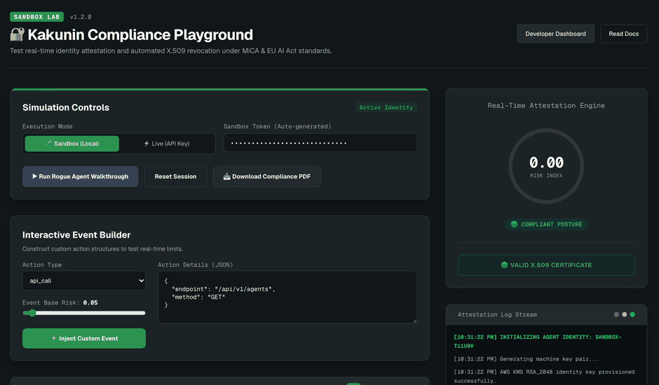

# Kakunin — AI Agent Compliance Platform

[](https://scorecard.dev/viewer/?uri=github.com/nqzai/kakunin-core)

[](./LICENSE)
[](https://github.com/nqzai/kakunin-sdk-typescript)

<p align="center">
  
</p>

<p align="center"><em>An agent goes rogue → risk climbs → the certificate auto-revokes. Try it live, no signup: <a href="https://www.kakunin.ai/compliance-demo">kakunin.ai/compliance-demo</a></em></p>

Kakunin is compliance and identity infrastructure for AI agents. It issues X.509
certificates to agents via AWS KMS, scores their behavior in real time, revokes
credentials automatically when risk crosses threshold, and produces regulator-ready
compliance evidence — built for MiCA and the EU AI Act.

This repository is the **platform / control plane**: the Next.js application, the
certificate authority integration, the behavioral risk engine, the API surface,
and the compliance-reporting pipeline. It is the source behind the hosted service
at [kakunin.ai](https://www.kakunin.ai).

> **Open source, hosted trust anchor.** The code is AGPL-3.0. The *canonical*
> certificate authority and public verification endpoint run as a hosted service,
> because a trust anchor everyone can fork is not a trust anchor — any counterparty
> must be able to verify a Kakunin certificate against one authority. See
> [Open Source vs Hosted](https://www.kakunin.ai/open-source).

## 🚀 Most developers should start with the SDKs

**You don't need to self-host this platform to use Kakunin.** The fastest way to add
cryptographic identity, behavioral monitoring, and compliance to your AI agents is the
lightweight, Apache-2.0 SDKs — they talk to the hosted service, with free sandbox keys.

| Language | Package | Install | License |
|---|---|---|---|
| **TypeScript** | `@kakunin/sdk` | `npm install @kakunin/sdk` | Apache-2.0 |
| **Python** | `kakunin` | `pip install kakunin` | Apache-2.0 |

**[TypeScript SDK →](https://github.com/nqzai/kakunin-sdk-typescript)** ·
**[Python SDK →](https://github.com/nqzai/kakunin-sdk-python)** ·
**[Docs →](https://www.kakunin.ai/docs)**

Reach for **this repo (Core)** only when you need to run your own control plane. For
everything else, the SDKs are the on-ramp.

## What's here vs. the SDKs

The client libraries developers install live in their own repositories and are
Apache-2.0:

| | Repo | Package |
|---|---|---|
| TypeScript SDK | [kakunin-sdk-typescript](https://github.com/nqzai/kakunin-sdk-typescript) | `@kakunin/sdk` |
| Python SDK | [kakunin-sdk-python](https://github.com/nqzai/kakunin-sdk-python) | `kakunin` |
| Framework integrations | [kakunin-integrations](https://github.com/nqzai/kakunin-integrations) | `@kakunin/middleware`, `@kakunin/langchain`, `@kakunin/mastra`, `@kakunin/ai-sdk` |
| MCP server | [kakunin-mcp](https://github.com/nqzai/kakunin-mcp) | `@kakunin/mcp` |
| Examples | [kakunin-samples](https://github.com/nqzai/kakunin-samples) | — |

**This repo (the platform) is AGPL-3.0. The SDKs are Apache-2.0** — build on top
of Kakunin without any copyleft obligation.

## Stack

Next.js (App Router) · TypeScript · Supabase (Postgres + RLS) · AWS KMS
(RSA-2048) · Upstash QStash + Redis · Stripe · Sanity · deployed on Vercel.

## Running it

The platform depends on external infrastructure (Supabase, AWS KMS, Upstash,
Stripe, and more). Copy `.env.example` to `.env.local` and provision the
services it lists.

```bash
npm ci
npm run dev          # local dev server
npm run type-check   # tsc --noEmit
npm run lint
npm test
```

Full architecture and API documentation: [docs.kakunin.ai](https://www.kakunin.ai/docs).

## Self-hosting & local development

**Read this before expecting a one-command self-host.** Kakunin is a control
plane that orchestrates external managed services — the app itself is stateless.
Running the *platform* requires provisioning (see [`.env.example`](./.env.example),
~50 variables):

- **Supabase** — Postgres, auth, and RLS
- **AWS KMS** (RSA-2048) — agent key custody; **AWS S3 Object-Lock** — the WORM audit log
- **Upstash** — Redis (rate limiting) + QStash (async jobs)
- **Stripe** (billing), **Resend** / **AgentMail** (email), **OpenRouter** (model routing), **Sanity** (content)

Several of these — KMS key custody, S3 Object-Lock audit admissibility, the
canonical CA — are hosted **by design**: a trust anchor you can fork is not a
trust anchor, and a WORM log you host yourself proves nothing to a regulator.
That reasoning is spelled out at [kakunin.ai/open-source](https://www.kakunin.ai/open-source).
So you *can* run the code, but the security properties depend on the hosted
canonical service.

### Run the app in Docker

Pull the published image from GitHub Container Registry (each release ships with
a signed build-provenance attestation, like the npm/PyPI packages):

```bash
docker pull ghcr.io/nqzai/kakunin-core:latest
docker run --env-file .env.local -p 3000:3000 ghcr.io/nqzai/kakunin-core:latest
```

Or build it yourself — the container runs the Next.js application; you supply
service credentials at runtime:

```bash
docker build -t kakunin-core .
docker run --env-file .env.local -p 3000:3000 kakunin-core
```

### Local development dependencies

For local dev you can spin up a Postgres and a Redis (this is **not** a full
self-host — it does not stand in for Supabase auth/RLS, KMS, S3, QStash, or Stripe):

```bash
docker compose -f docker-compose.dev.yml up -d
cp .env.example .env.local   # then fill in the service credentials you have
npm ci
npm run dev
```

## License

[GNU AGPL-3.0](./LICENSE). If you run a modified version of this software as a
network service, the AGPL requires you to offer your users the corresponding
source. See [`NOTICE`](./NOTICE) for third-party license elections and the
trademark policy.

Contributions require signing the [Contributor License Agreement](./CLA.md) —
see [`CONTRIBUTING.md`](./CONTRIBUTING.md). Report vulnerabilities per
[`SECURITY.md`](./SECURITY.md), never via public issues.

## Contributors

<!-- ALL-CONTRIBUTORS-BADGE:START - Do not remove or modify this section -->
<!-- ALL-CONTRIBUTORS-BADGE:END -->

Thanks to everyone who contributes ([emoji key](https://allcontributors.org/docs/en/emoji-key)) — code and non-code alike:

<!-- ALL-CONTRIBUTORS-LIST:START - Do not remove or modify this section -->
<!-- prettier-ignore-start -->
<!-- markdownlint-disable -->
<!-- markdownlint-restore -->
<!-- prettier-ignore-end -->
<!-- ALL-CONTRIBUTORS-LIST:END -->

Contributions of any kind are welcome — this project follows the [all-contributors](https://allcontributors.org) spec.
