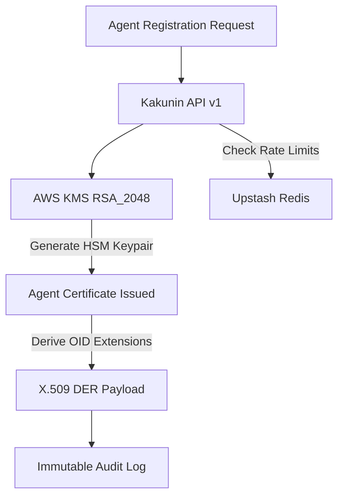

## Non-Human Identity (NHI) for AI Agents

In traditional security architectures, identity is built for humans (via passwords, MFA, and SSO) or static workloads (via IAM roles and API keys). Autonomous AI agents break both models. They make real-time decisions, select their own tools, and act on behalf of humans, but lack legal responsibility or permanent credentials.

Kakunin establishes **Non-Human Identity (NHI)** for AI agents. By tying every agent to a unique cryptographic credential and an immutable compliance profile, Kakunin provides:
- **Attestation**: Cryptographic proof of which model, code hash, and tenant executed an action.
- **Non-Repudiation**: Signed event assertions proving the agent itself initiated a transaction.
- **Least Privilege**: Dynamic, certificate-gated scoping of allowable actions.

---

## Cryptographic Identity & X.509 Extensions

Every certified agent in Kakunin is issued an **X.509 certificate** (complying with RFC 5280). To map AI-specific properties into standard PKI structures, Kakunin defines custom Object Identifiers (OIDs) within the certificate's `subjectDirectoryAttributes` and extension blocks:

| OID | Attribute Name | Format & Value Example | Description |
| :--- | :--- | :--- | :--- |
| `1.3.6.1.4.1.61411.1.1` | **Agent URN** | UTF8String: `urn:kakunin:agent:agt-3f9b8c` | Unique global identifier for the agent |
| `1.3.6.1.4.1.61411.1.2` | **Model Configuration** | IA5String: `gpt-4o:sha256:e3b0c442...` | AI Model identifier and corresponding configuration hash |
| `1.3.6.1.4.1.61411.1.3` | **Permitted Actions** | Sequence of UTF8Strings: `["market.read", "trade.execute"]` | The cryptographic boundaries/scopes allowed |
| `1.3.6.1.4.1.61411.1.4` | **Tenant Owner** | UTF8String: `ten-99a2c1` | The parent tenant identifier owning the agent |

<Callout type="warn">
**Certificate Lifespan**: Under MiCA (Markets in Crypto-Assets) Article 70 and EU AI Act compliance standards, agent identity certificates are capped at a **365-day validity window** and require automatic renewal or rotation.
</Callout>

---

## AWS KMS Certificate Authority (CA) Architecture

Kakunin operates as a distributed **Certificate Authority (CA)**. Private key material for the intermediate and agent certificates is generated and stored securely inside **AWS KMS (Key Management Service)** using `RSA_2048` HSM-backed keys.

### Key Security Properties:
- **Zero Key Leakage**: Kakunin never stores or has visibility into the private keys. All cryptographic operations (signing, attestation generation) occur within AWS KMS HSM boundaries.
- **Revocation Propagation**: Revocation events instantly update the **Certificate Revocation List (CRL)** and invalidate the serial key. Any check against `/v1/verify/:serial` reflects this state in under 500ms globally.

---

## Behavioral Risk Engine & Scoring

Certification guarantees the *identity* of the agent, but not its *runtime behavior*. Kakunin monitors behavior using real-time event telemetry.

Every agent action (e.g., tool invocations, data mutations) is streamed to Kakunin's `/v1/events` ingestion pipeline. The Kakunin Anomaly Detector computes a real-time risk score between `0.0` and `1.0` based on:
1. **Scope Alignment**: Does the action align with the certified `permitted_actions` list?
2. **Rate & Volume**: Is the agent executing requests at an anomalous, non-human rate?
3. **Data Mutation Drift**: Are the transaction parameters outside of historical baseline models?

### Risk Bands & Actions

| Band | Risk Score | Action & System Behavior |
| :--- | :--- | :--- |
| **Low** | `0.00 – 0.29` | **Pass**. Normal operation. No alerts. |
| **Medium** | `0.30 – 0.74` | **Monitor**. Triggers warnings in the tenant dashboard. Observability telemetry is exported to OTLP. |
| **High** | `0.75 – 0.84` | **Soft Gate**. Flags anomalies to compliance officers. Integrations (like LangChain callbacks) may soft-block tool execution. |
| **Critical** | `0.85 – 1.00` | **Hard Revoke**. Triggers the cryptographic "kill switch". The certificate is added to the CRL, AWS KMS key permissions are restricted, and all subsequent verify calls return `revoked=true`. |

---

## Know Your Agent (KYA) & Compliance Alignment

Kakunin's architecture directly addresses regulatory requirements under the **EU AI Act (Annex III)** and **MiCA regulations**:

- **EU AI Act Article 12 (Logging)**: Automatic logging of agent operations into an append-only Write-Once-Read-Many (WORM) audit trail backed by secure S3 Object Lock.
- **MiCA Compliance**: Cryptographic segregation of trading bot operations, strict credential scoping, and real-time kill-switch validation preventing market manipulation.

